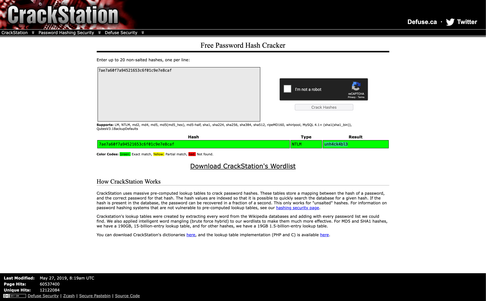
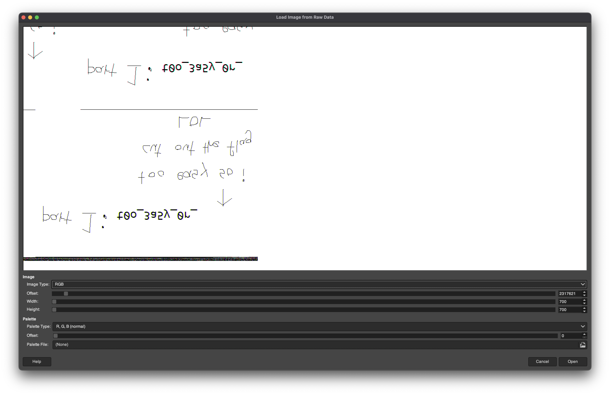
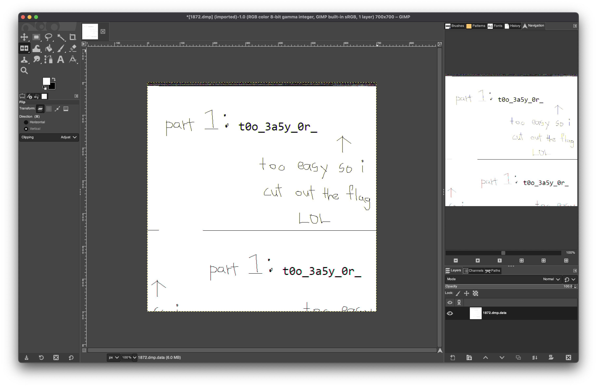

# `S.K.I.B.I.P.C.`

## Basics

We will need Volatility to solve this challenge. Specifically, we will use Volatility 2 as the `clipboard` plugin is not available in Volatility 3. This challenge should still be solvable with Volatility 3, but with a lot more effort...  

To obtain the correct profile for Volatility to use, we can run the `imageinfo` command:

```console
$ volatility -f SKIBIPC.raw imageinfo
Volatility Foundation Volatility Framework 2.6.1
INFO    : volatility.debug    : Determining profile based on KDBG search...
          Suggested Profile(s) : Win7SP1x86_23418, Win7SP0x86, Win7SP1x86_24000, Win7SP1x86
                     AS Layer1 : IA32PagedMemoryPae (Kernel AS)
                     AS Layer2 : FileAddressSpace (/Users/ljx1608/Desktop/sctf/SKIBIPC.raw)
                      PAE type : PAE
                           DTB : 0x185000L
                          KDBG : 0x8153ab78L
          Number of Processors : 1
     Image Type (Service Pack) : 1
                KPCR for CPU 0 : 0x81314000L
             KUSER_SHARED_DATA : 0xffdf0000L
           Image date and time : 2025-07-20 01:47:14 UTC+0000
     Image local date and time : 2025-07-20 01:47:14 +0000
```

Any of the suggested profiles should work, but we will use `Win7SP1x86` because it makes the commands shorter. :D

## Password

This part is rather straightforward. We obtain the hashes from the registry using the `hashdump` plugin:

```console
$ volatility -f SKIBIPC.raw --profile Win7SP1x86_23418 hashdump
Volatility Foundation Volatility Framework 2.6.1
Administrator:500:aad3b435b51404eeaad3b435b51404ee:31d6cfe0d16ae931b73c59d7e0c089c0:::
Guest:501:aad3b435b51404eeaad3b435b51404ee:31d6cfe0d16ae931b73c59d7e0c089c0:::
John:1000:aad3b435b51404eeaad3b435b51404ee:7ae7a60f7a94521653c6f01c9e7e8caf:::
```  

The LM hash can be ignored (it's all just empty hashes). The NT (or NTLM) hash for the user `John` is `7ae7a60f7a94521653c6f01c9e7e8caf`. We can crack this hash using wordlists with hashcat or John the Ripper, but in this case putting it into [CrackStation](https://crackstation.net/) is sufficient.  

  

The password is `unh4ck4bl3`.

## Part 1

Exploring the memdump, we notice that the `pslist` plugin shows an interesting process `mspaint.exe`:

```console
$ volatility -f SKIBIPC.raw --profile Win7SP1x86_23418 pslist
Volatility Foundation Volatility Framework 2.6.1
Offset(V)  Name                    PID   PPID   Thds     Hnds   Sess  Wow64 Start                          Exit
---------- -------------------- ------ ------ ------ -------- ------ ------ ------------------------------ ------------------------------
0x8280c400 System                    4      0     53      269 ------      0 2025-07-20 01:23:07 UTC+0000
0x82a35ab8 smss.exe                180      4      2       29 ------      0 2025-07-20 01:23:07 UTC+0000
0x82bc5d20 csrss.exe               252    244      9      185      0      0 2025-07-20 01:23:11 UTC+0000
0x82be64b0 wininit.exe             292    244      3       74      0      0 2025-07-20 01:23:12 UTC+0000
0x82bf1d20 csrss.exe               308    284      8      157      1      0 2025-07-20 01:23:12 UTC+0000
0x82bff3c0 winlogon.exe            332    284      3      110      1      0 2025-07-20 01:23:13 UTC+0000
0x82c18d20 services.exe            392    292      6      149      0      0 2025-07-20 01:23:15 UTC+0000
0x82c1ed20 lsass.exe               404    292      6      403      0      0 2025-07-20 01:23:15 UTC+0000
0x82c1fd20 lsm.exe                 412    292      9      134      0      0 2025-07-20 01:23:15 UTC+0000
0x82c55580 svchost.exe             500    392      9      333      0      0 2025-07-20 01:23:18 UTC+0000
0x82c67558 svchost.exe             564    392      6      194      0      0 2025-07-20 01:23:20 UTC+0000
0x82c80bd0 svchost.exe             636    392     16      285      0      0 2025-07-20 01:23:21 UTC+0000
0x82ca1570 svchost.exe             732    392      7      185      0      0 2025-07-20 01:23:26 UTC+0000
0x82b87548 svchost.exe             768    392     13      384      0      0 2025-07-20 01:23:29 UTC+0000
0x82b9f498 svchost.exe             872    392      7      141      0      0 2025-07-20 01:23:33 UTC+0000
0x82cef368 svchost.exe             940    392      8      263      0      0 2025-07-20 01:23:35 UTC+0000
0x82cfc030 svchost.exe             988    392     11      222      0      0 2025-07-20 01:23:36 UTC+0000
0x82d7a2b0 dwm.exe                1396    732      3       72      1      0 2025-07-20 01:25:41 UTC+0000
0x82d7bb58 explorer.exe           1404   1380     24      693      1      0 2025-07-20 01:25:42 UTC+0000
0x82d9a030 ctfmon.exe             1508   1404      2       79      1      0 2025-07-20 01:25:51 UTC+0000
0x82de5030 mspaint.exe            1872   1404      5      100      1      0 2025-07-20 01:40:36 UTC+0000
0x82de7d20 svchost.exe             164    392      6       99      0      0 2025-07-20 01:40:38 UTC+0000
0x82d51af8 DumpIt.exe              496   1404      5       38      1      0 2025-07-20 01:46:58 UTC+0000
0x82d79030 conhost.exe            1888    308      2       49      1      0 2025-07-20 01:46:58 UTC+0000
```  

We can dump the memory of this process using the `memdump` plugin with the PID of the process: `volatility -f SKIBIPC.raw --profile Win7SP1x86 memdump -p 1872 --dump-dir=.`  

We load this dump into GIMP as raw image data to get a visualisaiton of the bytes. (To get GIMP to accept the file as raw image data, we need to rename it with a `.data` extension.)  

Playing with the offset and dimensions, we can obtain the following image which looks interesting:
  

We can flip the image to get a more readable version:
  

Part 1 is `t0o_3a5y_0r_`.  

The written notes in the image imply that the flag is "cut".

## Part 2

Doing some guesswork and exploring (as one frequently does when trying to solve forens challs), we notice that the `clipboard` plugin gives us something interesting:

```console
$ volatility -f SKIBIPC.raw --profile Win7SP1x86 clipboard
Volatility Foundation Volatility Framework 2.6.1
Session    WindowStation Format                 Handle Object     Data
---------- ------------- ------------------ ---------- ---------- --------------------------------------------------
         1 WinSta0       CF_UNICODETEXT       0x230183 0xffa6d0c8 i5_1t_hMm
         1 WinSta0       0x0L                     0x10 ----------
         1 WinSta0       0x0L                      0x0 ----------
         1 WinSta0       0x0L                      0x0 ----------
         1 ------------- ------------------   0x3e008f 0xffab11c0
```  

Part 2 is `i5_1t_hMm`.

## Flag

Putting the 3 parts together in the correct flag format, we get the final flag: `sctf{t0o_3a5y_0r_i5_1t_hMm_unh4ck4bl3}`.
