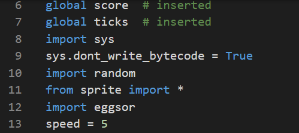
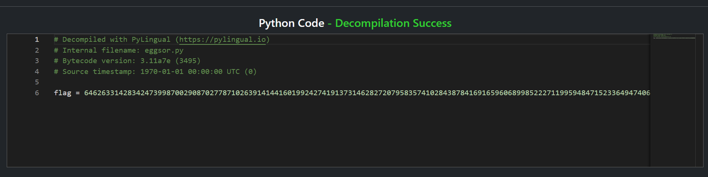

# Solution writeup here

We are given a game executable compiled with PyInstaller.  
  
We can extract the bytecode from the executable using [pyinstxtractor](https://github.com/extremecoders-re/pyinstxtractor), which can then be decompiled using an [online decompiler](https://pylingual.io/).  

Decompiling the main program bytecode `AGAIN.pyc` reveals an import from `eggsor`, which is clearly a pun of `xor`.   
  

We are indeed able to find the bytecode file `eggsor.pyc`, and upon decompilation, reveals the xor-encrypted flag.  

See `solve.py` for the decryption script.

## References

