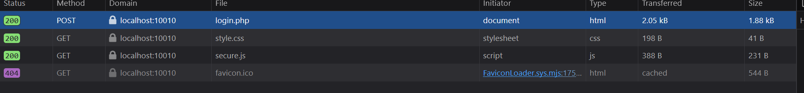
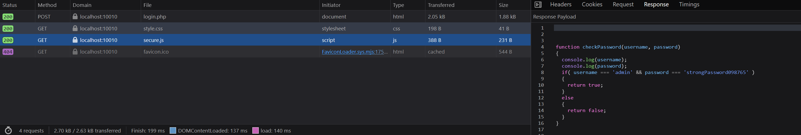

# picoCTF 2022 - Local Authority

Pull up the inspector (right click > Inspect) on your web browser. Then, input random credentials and log in. 

Notice that there are a couple of requests, of which one is to `secure.js`



Click into `secure.js` and check the response. 



```js
function checkPassword(username, password)
{    
  console.log(username);
  console.log(password);
  if( username === 'admin' && password === 'strongPassword098765' )
  {
    return true;
  }
  else
  {
    return false;
  }
}
```

Realise that credentials have been hard coded. Thus, log in with username as `admin` and password as `strongPassword098765` to get the flag.

